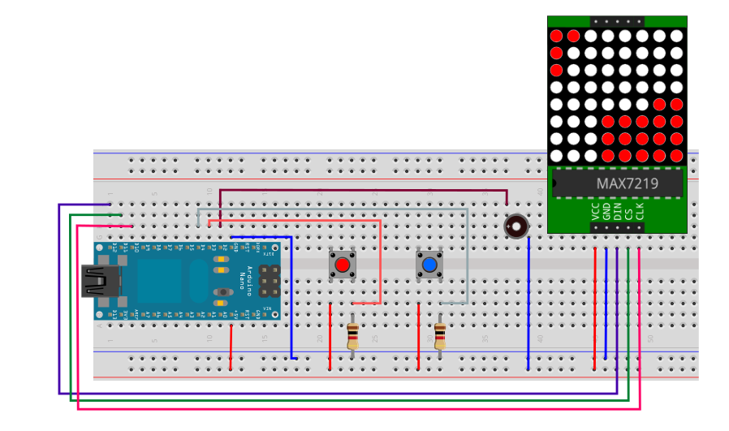
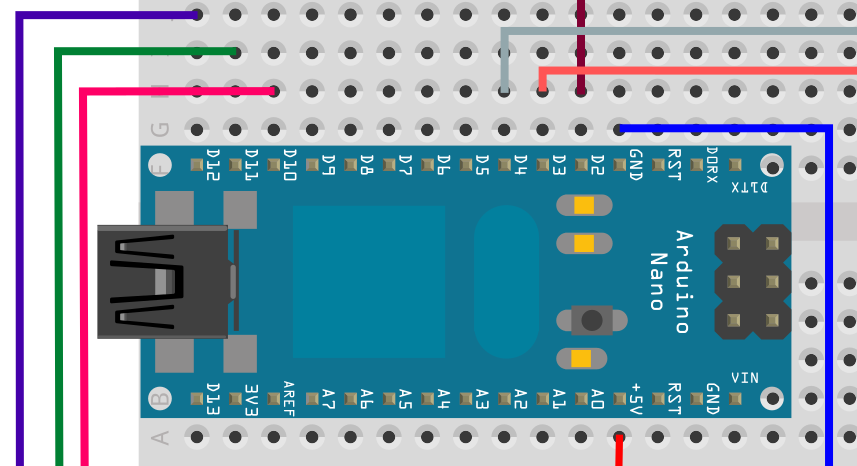
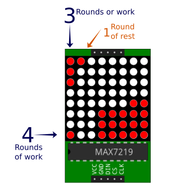

# Pomoduino

## Materials

- Arduino nano.
- 2 10KΩ resistors.
- 2 push buttons.
- 1 8x8 Led matrix MAX7219.
- 1 buzzer.

## Schematics

Conections details:

## How this work?

The pomoduino provides a way to track your time using the Pomodoro technique.
When you press one of the buttons you will have a slot of twenty five minutes
to focus. The other button gives you five minutes to rest.

After the time ends, a new light will turn on in the side of the led matrix.
Each light at the top of the matrix represents a completed round of work or
rest. Each time you complete four slots of the same type a light at the bottom
will turn. So in total you can count up to sixteen rounds of work/rest.

## Dependencies:

- https://github.com/wayoda/LedControl

## License

MIT
